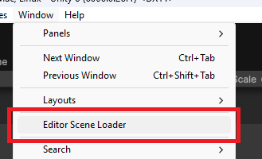
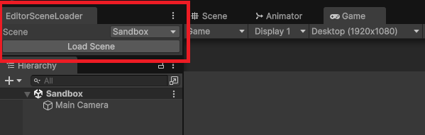
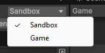

# Editor Scene Dropdown

A very simple and lightweight package to make your life easier.
Stop searching Scenes in the projet, just select them from a dropdown and load it.

## Example Usage

Open the Window accessing Window -> Editor Scene Loader

Drag the window to desired position in the Editor

Select desired Scene from the Dropdown menu (**The scene must be in the Build Settings**)

Click on Load Scene and the new Scene is Loaded in the Editor

